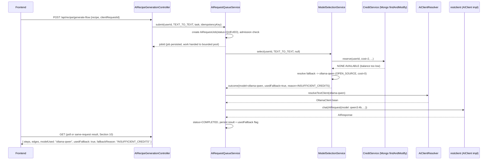
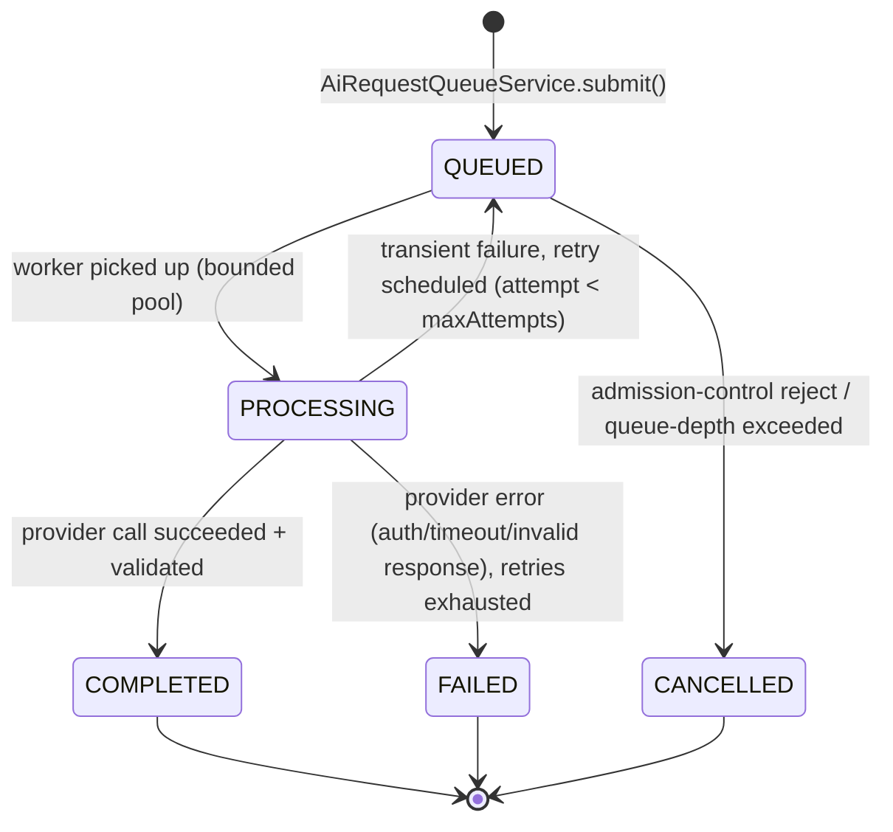
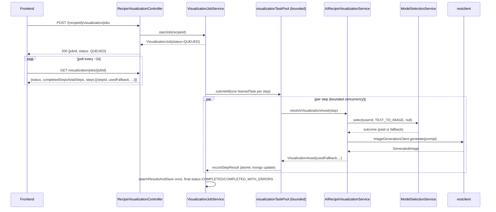

# AI Model Management, Credits, Fallback & Concurrency — Design Document

Status: Proposed
Scope: `backend` (Spring Boot / MongoDB) and `frontEnd` (React/TypeScript)
Target scale: 10–50 registered users, 5–10 concurrent users, concurrent text-to-text and text-to-image requests

---

## 1. Executive Summary

Virtual Kitchen already has a clean provider-agnostic abstraction for AI calls (`restclient/client/AIClient`, `ImageGenerationClient`, `ImageStorageClient`) and a working bounded-concurrency framework (`common/concurrent` `TaskPool`/`TaskPoolFactory`) that the visualization pipeline already uses. What it does **not** have today is:

- Any notion of a model being `PAID` vs `OPEN_SOURCE`.
- Any per-user credit/quota tracking.
- Any automatic fallback when a premium model is unavailable or unaffordable.
- Any bounded concurrency or queueing for **text-to-text** requests (recipe generation runs synchronously on the request thread with no cap at all), and only a partial, **unused-by-the-frontend** async job mechanism for text-to-image.

This document proposes extending the existing `ai/` and `restclient/` packages with four new, narrowly-scoped sub-areas — **registry**, **routing**, **credit**, **queue** — plus a thin **dispatch** layer that maps a routing decision to the correct existing `restclient` bean. No existing provider client, DTO contract, or controller is rewritten; the recipe-generation and visualization services are refactored to depend on the new routing/queue layer instead of directly on `AIClient`/`ImageGenerationClient`, but their own business logic (prompt building, validation, retry-on-invalid-flow, per-step image caching) is untouched.

No new infrastructure (Kafka, RabbitMQ, Kubernetes, microservices) is introduced. The existing in-process `TaskPool` framework is extended with two additional bounded pools and an admission-control counter; the design explicitly keeps the `AiRequestQueueService` interface broker-agnostic so it can later be backed by a real message broker without changing any caller.

---

## 2. Current Architecture Assessment

### 2.1 Provider abstraction (`restclient/`)

```
AIClient.chat(AIRequest) -> AIResponse                 // text-to-text
  ├── GeminiClient   @ConditionalOnProperty(ai.provider=gemini, matchIfMissing=true) @Primary
  ├── OpenAIClient   @ConditionalOnProperty(ai.provider=openai)
  └── OllamaClient   @ConditionalOnProperty(ai.provider=ollama)

ImageGenerationClient.generate(String prompt) -> GeneratedImage(mimeType, byte[])   // text-to-image
  ├── DrawThingsImageClient @ConditionalOnProperty(ai.image.provider=drawthings, matchIfMissing=true)
  └── GeminiImageClient     @ConditionalOnProperty(ai.image.provider=gemini)

ImageStorageClient.upload(byte[], mimeType, path) -> String url
  └── SupabaseImageStorageClient   (unconditional, only implementation)
```

**Critical constraint driving this whole design:** provider selection today is a **build/boot-time** decision, not a runtime one. `ai.provider` and `ai.image.provider` each gate a `@ConditionalOnProperty`, so Spring only ever instantiates **one** `AIClient` bean and **one** `ImageGenerationClient` bean for the entire application lifetime. `AIServiceImpl`, `AIRecipeGenerationService`, and `AIRecipeVisualizationService` all constructor-inject a single `AIClient aiClient` / `ImageGenerationClient imageGenerationClient`. There is no factory, no `Map<String, AIClient>`, no per-request provider choice anywhere in the codebase today.

This means the single biggest structural change this design requires is **making all provider clients simultaneously addressable** (Section 5), which is a small, low-risk change (removing a `@ConditionalOnProperty` and giving each bean a stable name) — not a rewrite.

`AIRequest`/`AIResponse` (`restclient/dto/`) already carry a `model` field, so per-call model override is already plumbed through every client implementation (`request.getModel()` is preferred over `properties.getDefaultModel()` in each `chat()` impl).

Errors already map to a small typed hierarchy: `AIClientException` → `AIAuthenticationException` (401/403), `AICommunicationException` (429/other HTTP/bad config), `AIInvalidResponseException` (malformed/empty body), `AITimeoutException` (`ResourceAccessException`). None of these currently carry a retryability flag or provider identifier — this design adds that information at the routing layer rather than changing the exception hierarchy's public shape.

### 2.2 `ai/` services

- **`AIServiceImpl`** (`IAIService.chat(String prompt)`): a simple one-shot chat endpoint with a hardcoded system prompt/temperature/token budget, picking its `model` string from `GeminiProperties`/`OpenAIProperties` based on the `ai.provider` value — with no `Ollama` branch, an existing inconsistency this design's routing layer subsumes rather than patches in place.
- **`AIRecipeGenerationService`**: the text-to-text recipe-flow generator. Builds a prompt (`AIRecipeFlowPromptBuilder`), calls `aiClient.chat()` once, validates the structured output (`AIRecipeValidator`), and — if invalid — retries **exactly once** with a feedback-augmented prompt (`buildRetryPrompt`) before throwing `RecipeFlowGenerationException`. Every attempt (success or failure) is persisted via `IAIResponseService` into the `ai_responses` collection (`AIResponseDocument`) — this is the closest existing thing to a usage log, and the natural anchor point for adding `userId`/model/credit fields (Section 8).
- **`AIRecipeVisualizationService`**: the real per-step image pipeline. `resolveVisualizationAsset(...)` is **already cache-first**: it computes a dedup key via `VisualizationKeyBuilder.buildFromNodeData(data)` and looks up an existing `VisualizationAsset` by that key before calling any AI/image provider — so identical steps are never regenerated. `generateImage()` deliberately **swallows all exceptions** and stores `imageUrl = null` on failure rather than propagating, which is why `VisualizationJobService` has to separately detect "effectively failed" steps.
- **`VisualizationJobService`**: the one place in the codebase that already does async, bounded-concurrency, job-tracked AI work. `startJob(recipeId)` creates a `VisualizationJob` (`status=QUEUED`, UUID id) and hands the actual pipeline to the `visualizationOrchestratorTaskPool`; the orchestrator sets `IN_PROGRESS` and fans the per-step work out across the `visualizationTaskPool` via `TaskPool.submitAll(...)`, recording each step's result with **atomic MongoDB updates** (`MongoTemplate` `push`/`inc`/`set`, not read-modify-write) — this is exactly the concurrency-safety pattern this design reuses for credit reservations.
- **`AIVisualizationServiceImpl`** is a legacy stub (never calls any AI client, only fabricates placeholder `VisualizationClip` records) — out of scope, not touched.

Async job endpoints for visualization **already exist** (`POST /api/recipes/{recipeId}/visualization/jobs`, `GET /api/recipes/visualization/jobs/{jobId}`) but the frontend does not call them — `FlowCanvas.tsx` still drives a client-side sequential loop over the **synchronous** per-step endpoint. This is a significant existing asset this design leans on (Section 11) rather than duplicating.

### 2.3 Concurrency framework (`common/concurrent/`)

```java
public interface Task<R> { R execute() throws Exception; }
public record NamedTask<R>(String taskId, Task<R> task) {}
public record TaskResult<R>(String taskId, R value, Throwable error) { boolean isSuccess(); ... }
public record BatchResult<R>(List<TaskResult<R>> results) { successes(); failures(); allSucceeded(); }

public interface TaskPool {
    <R> CompletableFuture<TaskResult<R>> submit(NamedTask<R> task);
    <R> BatchResult<R> submitAll(List<NamedTask<R>> tasks, Consumer<TaskResult<R>> onTaskComplete);
    int nThreads();
    void shutdown();
}
```

`ThreadPoolTaskPool` wraps a fixed-size, **unbounded-queue** `ExecutorService` (`Executors.newFixedThreadPool`), named daemon threads, and converts any thrown `Throwable` into a `TaskResult.failure(...)` (never propagates). `TaskPoolFactory` is a `@Component` with `getOrCreate(String name, int nThreads)` (memoized via `ConcurrentHashMap`) and a `@PreDestroy shutdownAll()`. `common/config/TaskPoolConfig.java` currently registers exactly two named pools — `"visualization"` (4 threads) and `"visualization-orchestrator"` (2 threads), deliberately kept separate "so a saturated pool can't deadlock against itself." This is the designed reuse point for any new bounded pool and is used as-is by this design (Section 9) — no changes to the `common/concurrent` package are required.

### 2.4 Persistence & service conventions

- Documents use Lombok `@Data`, `@Document(collection=...)`, a `Long id` populated via `common/SequenceGeneratorService.generateSequence(Entity.SEQUENCE_NAME)` (an atomic Mongo `findAndModify` counter — the same technique this design reuses for credit balances), except for job-shaped entities (`VisualizationJob`) which use a `String` UUID `@Id` instead.
- Repositories are plain `MongoRepository<Entity, Long>` with derived `findBy...` query methods — no `@Query` annotations in use.
- Entity↔DTO mapping is manual, one `@Component` mapper class per entity in the flat `common/mapper` package (`toEntity`/`toDTO`), not MapStruct.
- Errors are centralized in `common/exception/GlobalExceptionHandler` (`@RestControllerAdvice`), each mapped to an HTTP status + a flat `ErrorResponse{timestamp, status, error, message}` body. Successful responses in the `ai`/`recipe` visualization controllers use `common/utils/ApiResponse<T>{success, message, data, timestamp}` (though `AIController`/`AIRecipeGenerationController`/`AIResponseController` return raw DTOs without this envelope — a pre-existing inconsistency, not something this design needs to fix).
- `auth/model/User.java` has **no** plan/tier/credit/usage field of any kind today — `id(Long), name, email, passwordHash, emailVerified, authProvider, googleId, userType, createdAt, updatedAt, status`. A grep across the whole backend for `credit|quota|rateLimit|throttle` found nothing except log strings for *externally*-imposed 429s from Gemini/OpenAI. **Credits/quota is a genuinely new feature area**, not an extension of an existing partial one.
- `common/config/SecurityConfig.java` currently `permitAll()`s the entire `"/api/**"` prefix (only `/api/v1/auth/me` and the catch-all `anyRequest()` require authentication) — new endpoints added under `/api/**` inherit this unless a more specific matcher is added first. This is flagged again in Section 20 (Security).

### 2.5 Frontend request handling

- `api/client.ts` is a hand-rolled `fetch` wrapper (not axios): a 300s default timeout, per-request `Authorization` header injection, and an error path that only ever surfaces `Error.message` — there is no structured error type, no HTTP-status-aware handling on the client today.
- The client **auto-unwraps** a top-level `data` key if present in the JSON body (to transparently support both the `ApiResponse<T>` envelope and raw DTOs) — any new response field must live either inside that unwrapped payload or alongside `message`, and must not collide with the reserved `data`/`success`/`timestamp` keys.
- There is **no polling logic anywhere in the frontend** — `RecipeVisualizationApi.generate`/`generateStep` are called and awaited synchronously; `FlowCanvas.generateVisuals()` loops over steps sequentially, awaiting each `generateStep` call in turn, and only tracks an aggregate `{completed, total}` counter and a boolean success/fail count — individual step failure reasons are discarded.
- The shared toast system (`shared/components/notifications/NotificationProvider.tsx`, `useNotifications()`) supports only `'success' | 'error'` and is **not used** by any AI/visualization/recipe-generation code path today (those use bespoke inline banners in `RecipeBuilderPanel`/`FlowEditorTopBar`, plus a stray native `alert()` on generation failure). A "standard model used because premium credits are exhausted" message is neither a success nor an error — the type union needs a neutral variant.

### 2.6 Summary of gaps this design closes

1. No `PAID`/`OPEN_SOURCE` (or any) model classification.
2. Provider selection is boot-time/global, not per-request — blocks any fallback or user-facing model choice.
3. No credit ledger, no per-user quota, no reservation/consumption/release semantics.
4. No bounded concurrency or queueing for text-to-text (recipe generation runs unbounded on the servlet thread).
5. Text-to-image concurrency exists but is entirely synchronous+unused (from the frontend's point of view) and has no credit/model awareness.
6. No idempotency/duplicate-request protection at the request level (asset-level dedup exists for visualization only).
7. No frontend vocabulary for "fallback used" or job-status states beyond a binary `not_generated`/`generated`.

---

## 3. Proposed Architecture

```
                                   ┌─────────────────────────────┐
Controllers (existing, adapted)   │   AIRecipeGenerationController│  AIController  RecipeVisualizationController
                                   └───────────────┬──────────────┘
                                                    │
                                   ┌────────────────▼──────────────┐
                                   │      AiRequestQueueService      │  (new — ai/queue)
                                   │  admission control, job persist,│
                                   │  submits work to bounded pools  │
                                   └───────┬─────────────┬──────────┘
                                           │             │
                     ┌─────────────────────▼──┐   ┌──────▼───────────────┐
                     │  ModelSelectionService   │   │   CreditService       │  (new — ai/routing, ai/credit)
                     │  registry lookup +       │   │  reserve/consume/     │
                     │  fallback decision       │   │  release (atomic)     │
                     └─────────────┬────────────┘   └───────────────────────┘
                                   │
                     ┌─────────────▼────────────┐
                     │     AiClientResolver       │  (new — ai/dispatch)
                     │  ModelDefinition -> bean   │
                     └─────────────┬────────────┘
                                   │
                     ┌─────────────▼──────────────────────────┐
                     │   restclient/  (UNCHANGED)                │
                     │   AIClient, ImageGenerationClient,        │
                     │   ImageStorageClient + impls              │
                     └────────────────────────────────────────┘

  AIRecipeGenerationService / AIRecipeVisualizationService (existing business logic,
  prompt building, validation, per-step caching) now call through AiRequestQueueService
  instead of injecting AIClient/ImageGenerationClient directly.
```

New Java sub-packages, all under the existing `ai/` feature package (co-located with what they extend, per the codebase's feature-based convention):

| Package | Responsibility |
|---|---|
| `ai/registry` | Model/provider registry & classification (`PAID`/`OPEN_SOURCE`) |
| `ai/routing` | Model selection + fallback decision (no provider calls, no credit mutation) |
| `ai/credit` | Credit account, ledger, atomic reserve/consume/release |
| `ai/queue` | Request/job persistence, bounded worker pools, admission control |
| `ai/dispatch` | Thin adapter: `ModelDefinition` → concrete `AIClient`/`ImageGenerationClient` bean, normalized invocation + exception translation |

None of these packages touches `restclient/`; `restclient/` remains the sole owner of provider HTTP concerns, exactly as today.

---

## 4. Model/Provider Registry Design

### 4.1 Classification enums

```java
package com.processVisualisation.virtualKitchen.ai.registry;

/** Extensible on purpose — do not collapse to a boolean. Future values might include
 *  ENTERPRISE, FREE_TRIAL, BYO_KEY, etc. without touching selection/credit logic. */
public enum ModelTier {
    PAID,
    OPEN_SOURCE
}

public enum AiCapability {
    TEXT_TO_TEXT,
    TEXT_TO_IMAGE
    // future: TEXT_TO_VIDEO, TEXT_TO_SPEECH, ...
}
```

### 4.2 `ModelDefinition` — the registry entry

```java
public record ModelDefinition(
    String key,                 // stable id, e.g. "gemini-flash", "ollama-qwen3-4b", "openai-gpt-4o-mini", "gemini-image", "drawthings-sdxl"
    AiCapability capability,
    ModelTier tier,
    String providerBeanName,    // e.g. "geminiAiClient" / "ollamaAiClient" / "geminiImageClient" / "drawThingsImageClient"
    String providerModelId,     // value written into AIRequest.model / passed to ImageGenerationClient, e.g. "gemini-3.5-flash", "qwen3:4b"
    int creditCost,             // credits consumed per successful request (0 for OPEN_SOURCE)
    String fallbackModelKey,    // nullable — the OPEN_SOURCE model to use when this PAID model's credits are exhausted
    boolean enabled             // operator kill-switch, no redeploy needed
) {}
```

This deliberately mirrors the *existing* per-provider `*Properties` classes rather than replacing them — `ModelDefinition.providerModelId` is exactly what's already stored in `GeminiProperties.defaultModel`/`OllamaProperties.defaultModel`/etc. The registry is a **new, thin layer on top of the existing properties**, not a duplicate of them.

### 4.3 `AiModelRegistry`

A single `@Component`, populated once at startup from configuration (Section 14) and never mutated at runtime except for the `enabled` flag (toggle-able via a lightweight admin endpoint, Section 15, backed by a one-row-per-model Mongo override collection — see below):

```java
@Component
public class AiModelRegistry {
    Optional<ModelDefinition> find(String key);
    List<ModelDefinition> byCapability(AiCapability capability);
    ModelDefinition defaultFor(AiCapability capability);           // configured default PAID model
    Optional<ModelDefinition> fallbackFor(ModelDefinition paid);    // resolves fallbackModelKey
}
```

**Why config-driven, not Mongo-driven, for the static definition:** model definitions change rarely (adding a new provider is a deploy event — a new `*Properties`/`AIClient` bean is still needed either way) and must be consistent with the `restclient` bean wiring, which is itself config-driven. A small `ai_model_overrides` Mongo collection (`{modelKey, enabled, creditCost}`) is layered on top purely so an operator can disable a misbehaving model or tweak a credit cost **without a redeploy** — `AiModelRegistry` merges config defaults with any override document at startup and on a short (e.g. 60s) refresh poll. This avoids inventing a full admin-config system while still meeting "easily add/replace paid and open-source models" (config change + optional override) and giving an operational kill switch.

### 4.4 Model selection is never hard-coded into business logic

Neither `AIRecipeGenerationService` nor `AIRecipeVisualizationService` will reference `ModelTier`, a provider name, or a credit cost anywhere. They call `AiRequestQueueService.submit(userId, capability, ...)`; everything about *which* model runs is resolved by `ModelSelectionService` + `AiModelRegistry` and reported back as metadata on the job result.

---

## 5. Removing the single-active-provider constraint

Today `GeminiClient`/`OpenAIClient`/`OllamaClient` are mutually exclusive via `@ConditionalOnProperty(..., havingValue=...)`. To allow simultaneous PAID + OPEN_SOURCE availability (required for fallback), this design changes each to an **unconditional, explicitly-named bean**, keeping `@Primary` on `GeminiClient` only so the few pre-existing single-`AIClient`-injection sites that aren't yet migrated (if any remain during rollout) keep compiling:

```java
@Component("geminiAiClient")
@Primary
public class GeminiClient implements AIClient { ... }   // unchanged internals

@Component("openAiAiClient")
public class OpenAIClient implements AIClient { ... }    // unchanged internals

@Component("ollamaAiClient")
public class OllamaClient implements AIClient { ... }    // unchanged internals
```

Same treatment for `GeminiImageClient` (`"geminiImageClient"`) / `DrawThingsImageClient` (`"drawThingsImageClient"`). This is a mechanical, low-risk change (delete one annotation, add a bean name) — **zero changes to any client's method bodies, HTTP handling, or error mapping.**

### `AiClientResolver` (new, `ai/dispatch`)

```java
@Component
public class AiClientResolver {
    private final Map<String, AIClient> textClients;              // Spring auto-collects all AIClient beans keyed by bean name
    private final Map<String, ImageGenerationClient> imageClients;

    public AIClient resolveTextClient(ModelDefinition model) { return textClients.get(model.providerBeanName()); }
    public ImageGenerationClient resolveImageClient(ModelDefinition model) { return imageClients.get(model.providerBeanName()); }
}
```

`AIServiceImpl`, `AIRecipeGenerationService`, and `AIRecipeVisualizationService` stop constructor-injecting `AIClient`/`ImageGenerationClient` directly; they go through the queue/dispatch layer instead (Sections 9–11). This is the one unavoidable code change to existing services, and it is exactly the seam the codebase's own `restclient` package Javadoc already asks for ("Callers depend on this abstraction ... so the active provider can be swapped").

---

## 6. Model Selection / Fallback Algorithm

```java
package com.processVisualisation.virtualKitchen.ai.routing;

public record ModelSelectionOutcome(
    ModelDefinition model,
    boolean usedFallback,
    FallbackReason fallbackReason,   // null unless usedFallback
    Long reservationId                // null for OPEN_SOURCE (nothing reserved)
) {}

public enum FallbackReason { INSUFFICIENT_CREDITS, PREFERRED_MODEL_DISABLED, NONE }
```

```java
@Service
public class ModelSelectionService {

    public ModelSelectionOutcome select(Long userId, AiCapability capability, String preferredModelKey) {
        ModelDefinition candidate = resolveCandidate(capability, preferredModelKey);   // registry lookup, falls back to configured default

        if (candidate.tier() == ModelTier.OPEN_SOURCE) {
            return new ModelSelectionOutcome(candidate, false, FallbackReason.NONE, null);
        }

        // PAID path: try to reserve credits atomically (Section 7)
        Optional<Long> reservationId = creditService.reserve(userId, candidate.creditCost(), capability, candidate.key());
        if (reservationId.isPresent()) {
            return new ModelSelectionOutcome(candidate, false, FallbackReason.NONE, reservationId.get());
        }

        // Insufficient credits -> look for configured fallback
        Optional<ModelDefinition> fallback = registry.fallbackFor(candidate)
                .filter(ModelDefinition::enabled);
        if (fallback.isPresent()) {
            return new ModelSelectionOutcome(fallback.get(), true, FallbackReason.INSUFFICIENT_CREDITS, null);
        }

        // No fallback available -> caller surfaces a clear, non-blocking-of-other-features error
        throw new NoAvailableModelException(capability);
    }
}
```

`NoAvailableModelException` is new (`ai/routing`), mapped by `GlobalExceptionHandler` to `503 SERVICE_UNAVAILABLE` with an explicit message ("Premium credits are exhausted and no standard model is currently configured for this operation. Please try again later."). This satisfies "define behavior when no suitable fallback model is available" without ever blocking unrelated features — only the specific AI call fails, nothing else in the request pipeline is affected.

### Sequence: text-to-text with fallback



---

## 7. Credit Data Model & Transaction/Consistency Strategy

### 7.1 Why a separate document, not fields on `User`

`UserAiCredit` is its own 1:1 document (not new fields on `auth/model/User`) so that high-frequency credit read/reserve/release traffic never contends with (or accidentally races) unrelated user-profile writes (name/email/status changes), and so the existing `User` document/collection/repository is untouched.

```java
package com.processVisualisation.virtualKitchen.ai.credit;

@Data
@Document(collection = "user_ai_credits")
public class UserAiCredit {
    @Id
    private Long userId;                 // same id space as User.id — no separate sequence needed, it *is* the FK

    private int monthlyAllocation;       // configurable, defaults from ai.credits.default-monthly-allocation
    private int availableBalance;        // spendable now (allocation - consumed - reserved)
    private int reservedBalance;         // sum of credits held by in-flight (PROCESSING) requests
    private LocalDate cycleStart;
    private LocalDate cycleEnd;

    @CreatedDate private LocalDateTime createdAt;
    @LastModifiedDate private LocalDateTime updatedAt;
}
```

```java
@Document(collection = "ai_credit_transactions")   // append-only audit ledger
@Data
public class AiCreditTransaction {
    @Id
    private String id;                    // Mongo ObjectId string is fine; this is audit-only, never looked up by sequence
    @Indexed private Long userId;
    @Indexed private String requestId;    // AiRequestJob.id — links ledger entry to the request that caused it
    private CreditTransactionType type;   // RESERVE, CONSUME, RELEASE, MONTHLY_GRANT, ADMIN_ADJUSTMENT
    private int amount;                   // signed: negative for RESERVE/CONSUME, positive for RELEASE/GRANT
    private int balanceAfter;
    private AiCapability capability;
    private String modelKey;
    private ModelTier tier;
    @CreatedDate private LocalDateTime createdAt;
}
```

### 7.2 Atomic reserve/consume/release — the concurrency-safety core

This directly reuses the pattern already proven in `common/SequenceGeneratorService` (a single atomic `findAndModify` rather than read-then-write):

```java
@Service
public class CreditService {

    private final MongoTemplate mongoTemplate;

    /** Returns empty if the user does not have `cost` available credits right now.
     *  Atomic at the MongoDB document level: concurrent callers cannot both succeed
     *  past the balance check, so a user can never be over-committed even under
     *  10 simultaneous requests. */
    public Optional<Long> reserve(Long userId, int cost, AiCapability capability, String modelKey) {
        if (cost == 0) return Optional.of(0L);   // OPEN_SOURCE / free operations never reserve

        Query query = Query.query(where("userId").is(userId).and("availableBalance").gte(cost));
        Update update = new Update().inc("availableBalance", -cost).inc("reservedBalance", cost);

        UserAiCredit updated = mongoTemplate.findAndModify(
                query, update, FindAndModifyOptions.options().returnNew(true), UserAiCredit.class);

        if (updated == null) {
            return Optional.empty();   // either not enough balance, or no credit doc (treated as zero balance)
        }
        String txId = appendLedger(userId, RESERVE, -cost, updated.getAvailableBalance(), capability, modelKey);
        return Optional.of(reservationIdFor(txId));
    }

    /** Called when the job reaches COMPLETED: the reservation becomes a permanent charge. */
    public void consume(Long userId, long reservationId, int cost, ...) {
        mongoTemplate.updateFirst(
            Query.query(where("userId").is(userId)),
            new Update().inc("reservedBalance", -cost),
            UserAiCredit.class);
        appendLedger(userId, CONSUME, 0, ..., ...);   // balance already adjusted at reserve time; this is a bookkeeping/audit entry
    }

    /** Called when the job reaches FAILED/CANCELLED (or times out before starting): refund. */
    public void release(Long userId, long reservationId, int cost, ...) {
        mongoTemplate.updateFirst(
            Query.query(where("userId").is(userId)),
            new Update().inc("availableBalance", cost).inc("reservedBalance", -cost),
            UserAiCredit.class);
        appendLedger(userId, RELEASE, +cost, ..., ...);
    }
}
```

**Why this prevents overspend under concurrency:** the `gte(cost)` filter is evaluated by MongoDB as part of the same atomic document operation that performs the decrement — there is no window between "check balance" and "deduct balance" for a second concurrent request to slip through, unlike a naive `find()` then `save()` (which is exactly the anti-pattern `SequenceGeneratorService` already avoids in this codebase). This holds regardless of how many application instances or threads call `reserve()` concurrently, because MongoDB serializes writes to a single document.

**Ledger vs. balance consistency:** the balance mutation and the ledger append are two separate writes (two documents). If the ledger write fails after the balance write succeeds, `UserAiCredit` (the fast-path source of truth for "can this user spend right now") is still correct; only the audit trail is missing an entry, which is an acceptable, explicitly-chosen trade-off at this scale rather than requiring multi-document Mongo transactions (which need a replica-set deployment). If stronger audit consistency is later required, `MongoTemplate` transactions (`ClientSession`) can wrap both writes without changing this method's public signature — noted as a scalability-path item (Section 19), not built now.

### 7.3 Idempotency & duplicate requests

- The frontend generates a `clientRequestId` (UUID) per user-initiated action (one click of "Generate" or "Generate Visuals") and sends it as an additive, optional field on the existing request DTOs.
- `AiRequestJob` (Section 8) has a compound unique index on `(userId, idempotencyKey)`. If the key is absent (older/unmigrated clients), the backend synthesizes one from `hash(userId + capability + normalizedInput)` bucketed to a short window (e.g. 5s) — enough to absorb an accidental double-click/double-submit without changing the request contract.
- On a duplicate submission: `AiRequestQueueService` attempts to insert the new `AiRequestJob`; a `DuplicateKeyException` (already handled generically by `GlobalExceptionHandler` → 409) is caught **specifically here** and translated into "return the existing job" (look it up and respond with its current status) rather than surfacing a raw 409 to a legitimate retry — no new credit reservation is attempted for the duplicate.
- For text-to-image, the **existing** `VisualizationAsset.visualizationKey` dedup (Section 2.2) already prevents redundant image generation for identical step content; the new job-level idempotency key additionally prevents redundant **credit reservations/job rows** for near-simultaneous duplicate HTTP calls, which is a different (request-level, not content-level) concern.

### 7.4 Monthly reset

A `@Scheduled` job (`CreditCycleResetJob`, new, `ai/credit`) runs daily, finds every `UserAiCredit` whose `cycleEnd < today`, and atomically resets `availableBalance = monthlyAllocation`, `reservedBalance = 0` (any stuck reservation past a full cycle is a bug elsewhere, not something to preserve), `cycleStart/cycleEnd` advanced by one month, appending a `MONTHLY_GRANT` ledger entry. Runs via the same `findAndModify`-per-document pattern; safe to run on multiple instances since each document's reset is independently atomic and idempotent within the same day (guarded by the `cycleEnd < today` filter itself — a second run the same day finds nothing left to reset).

### 7.5 Credit cost configuration (not hard-coded)

`creditCost` lives on `ModelDefinition` (Section 4.2), sourced from configuration (Section 14) — e.g. Gemini Flash chat = 1 credit, OpenAI = 2 credits, Gemini image = 5 credits, all `OPEN_SOURCE` models = 0. Changing a price is a config/override change, never a code change, and never referenced by name inside `AIRecipeGenerationService`/`AIRecipeVisualizationService`.

---

## 8. AI Request/Job Lifecycle

```java
package com.processVisualisation.virtualKitchen.ai.queue;

public enum AiRequestStatus { QUEUED, PROCESSING, COMPLETED, FAILED, CANCELLED }

@Data
@Document(collection = "ai_request_jobs")
public class AiRequestJob {
    @Id private String id;                       // UUID string, same convention as VisualizationJob
    @Indexed private Long userId;
    private AiCapability capability;
    private String requestedModelKey;             // user/UI preference, nullable
    private String resolvedModelKey;
    private ModelTier resolvedTier;
    private boolean usedFallback;
    private String fallbackReason;
    private int creditCost;
    private String creditTransactionId;

    private AiRequestStatus status;
    @Indexed(unique = true) private String idempotencyKey;
    private int attempt;
    private int maxAttempts;

    // correlates back to the domain object this request was for, without a hard FK type
    private String correlationType;   // "recipe-generation" | "visualization-step" | "chat"
    private String correlationId;     // e.g. recipeId, or recipeId:stepId

    private Instant queuedAt;
    private Instant startedAt;
    private Instant completedAt;
    private String errorMessage;
}
```

State machine (mirrors `VisualizationJobStatus`'s existing shape/spirit, generalized to a single request rather than a multi-step batch):



This new `AiRequestJob` is a finer-grained sibling of the existing `VisualizationJob`, not a replacement: `VisualizationJob` continues to represent "generate all steps of one recipe visualization" (a batch), while one `AiRequestJob` row now backs **each individual provider call** inside that batch (and also backs the previously-untracked recipe-generation and single-step calls). `VisualizationJobService`'s existing `StepResult` gains three additive fields — `modelKey`, `tier`, `usedFallback` — populated from the corresponding `AiRequestJob` once each step's task completes.

---

## 9. Concurrency & Queue Design

### 9.1 New bounded pools (via existing `TaskPoolFactory`, no `common/concurrent` changes)

```java
// common/config/TaskPoolConfig.java — additive beans, same pattern as the existing two
@Bean
public TaskPool aiTextTaskPool(TaskPoolFactory f, @Value("${app.taskpool.ai-text.n-threads:4}") int n) {
    return f.getOrCreate("ai-text", n);
}
```

Text-to-text (recipe generation, chat) gets its **own** new pool, `"ai-text"`, because today it runs **unbounded** on the Tomcat request thread — the single biggest concurrency gap this design closes. Text-to-image continues to use the existing `"visualization"`/`"visualization-orchestrator"` pools unchanged, since that concurrency control already exists and works; only the *work submitted to it* changes (it now goes through `AiRequestQueueService` for model selection + credit handling instead of calling `AIRecipeVisualizationService` directly).

### 9.2 Admission control (backpressure) without changing `TaskPool`

`ThreadPoolTaskPool`'s internal queue is unbounded by construction (`Executors.newFixedThreadPool`), so an unbounded number of callers could still queue infinite work even though only N run at once — for 5–10 concurrent users this is unlikely to matter, but the design still caps it explicitly rather than relying on that being true forever:

```java
@Service
public class AiRequestQueueService {
    private final Map<String, AtomicInteger> inFlightByPool = new ConcurrentHashMap<>();
    // ...
    public AiRequestJob submit(Long userId, AiCapability capability, Supplier<AiOutcome> work, String idempotencyKey) {
        String poolName = poolFor(capability);
        int maxQueueDepth = queueDepthLimits.get(poolName);   // config, e.g. ai-text=20, visualization=30

        if (inFlightByPool.computeIfAbsent(poolName, k -> new AtomicInteger()).get() >= maxQueueDepth) {
            throw new AiQueueFullException(capability);        // -> 429, fail fast, never silently pile up
        }
        // create AiRequestJob(QUEUED), persist, increment counter, submit to pool, decrement in finally
    }
}
```

This keeps `common/concurrent` completely untouched (no interface change, no risk to the existing visualization pipeline) while adding the missing bounded-queue guarantee purely in the new service layer. `AiQueueFullException` → `429 TOO_MANY_REQUESTS` ("The AI system is busy — please try again in a moment"), satisfying "prevent unlimited simultaneous AI requests" without ever touching unrelated features.

### 9.3 Timeout, retry, backoff

| Failure | Retry? | Backoff | Credit outcome | Job status |
|---|---|---|---|---|
| `AITimeoutException` | yes, 1 retry | fixed 500ms | released if all retries exhausted | `FAILED` after retries, else stays `PROCESSING`→retried |
| `AICommunicationException` (5xx/429 from provider) | yes, 1 retry | fixed 1000ms (respects provider being rate-limited) | released if exhausted | as above |
| `AIAuthenticationException` | no (config error, retrying won't help) | — | released immediately | `FAILED` |
| `AIInvalidResponseException` | no (deterministic malformed output) | — | released immediately | `FAILED` |
| Job-level timeout (worker never returned within `ai.request.timeout-ms`) | no (assume stuck) | — | released | `FAILED`, `errorMessage="timeout"` |
| Queue-full / admission reject | n/a — never queued | — | never reserved | `CANCELLED` |

Retries reuse the **same** reserved credit (no double-charge for the internal retry — credits are only consumed once, at final `COMPLETED`, matching the existing `AIRecipeGenerationService` behavior of retrying once internally before failing). Retry/backoff constants are configurable (Section 14), not hard-coded per call site.

### 9.4 Scalability path — swapping the queue implementation later

`AiRequestQueueService.submit(...)` returns a persisted `AiRequestJob` and hands work to a `TaskPool`. If traffic later outgrows a single in-process JVM, only the **inside** of `submit`/the worker pickup loop changes (e.g., publish to a broker and have a separate worker process consume and call the same `ModelSelectionService`/`CreditService`/`AiClientResolver` chain) — the public method signature, the `AiRequestJob` persistence model, and every caller (controllers, `VisualizationJobService`) stay identical. This is why job state lives in MongoDB rather than in-memory: it is already multi-instance-safe and broker-migration-ready without any caller-visible change.

---

## 10. Text-to-Text Flow (Recipe Generation)

`AIRecipeGenerationController` and `AIRecipeGenerationService` keep their existing prompt-building, validation, and one-retry-on-invalid-output logic untouched. The only change: instead of calling `aiClient.chat(request)` directly, `generateFlow(...)` now goes through the queue layer, which resolves the model, reserves credit, and dispatches:

```java
@Service
public class AIRecipeGenerationService {
    // unchanged: promptBuilder, AIRecipeValidator, aiResponseService
    // changed: AIClient aiClient  -->  AiRequestQueueService queueService

    public RecipeFlowGenerationResult generateFlow(Long userId, String recipeText, String clientRequestId) {
        AiRequestJob job = queueService.submit(
            userId, AiCapability.TEXT_TO_TEXT,
            () -> runAttemptWithRetry(recipeText),   // existing method body, unchanged internals
            clientRequestId
        );
        AiOutcome outcome = queueService.awaitResult(job.getId(), Duration.ofSeconds(25));  // v1: blocking wait, see Section 19
        return new RecipeFlowGenerationResult(outcome.steps(), outcome.edges(),
                outcome.modelKey(), outcome.tier(), outcome.usedFallback(), outcome.fallbackReason());
    }
}
```

Because the pool is bounded (Section 9.1), at most `app.taskpool.ai-text.n-threads` recipe-generation calls run against a provider concurrently, regardless of how many HTTP requests arrive — directly answering "prevent unlimited simultaneous AI requests from exhausting ... local model resources ... or application threads," specifically for the local Ollama case where a single machine's CPU/GPU is the real bottleneck.

The controller keeps returning a synchronous-looking response (v1 — see Section 19 for the fully-async alternative), now carrying the extra fallback metadata:

```json
{
  "steps": [...],
  "edges": [...],
  "modelUsed": "ollama-qwen3-4b",
  "modelTier": "OPEN_SOURCE",
  "usedFallback": true,
  "fallbackReason": "INSUFFICIENT_CREDITS"
}
```

---

## 11. Text-to-Image Flow (Visualization)

`AIRecipeVisualizationService.resolveVisualizationAsset(...)` keeps its existing cache-first check (`VisualizationKeyBuilder` + `findByVisualizationKey`) completely unchanged — that stays the first line of defense against redundant work. Only the "actually call the provider" branches (`generatePrompt`, `generateImage`) are re-pointed at the dispatch layer instead of the raw `AIClient`/`ImageGenerationClient` fields:

```java
private VisualizationAsset generatePrompt(...) {
    ModelSelectionOutcome outcome = modelSelectionService.select(currentUserId(), AiCapability.TEXT_TO_TEXT, null);
    AIClient client = aiClientResolver.resolveTextClient(outcome.model());
    AIResponse response = client.chat(request.toBuilder().model(outcome.model().providerModelId()).build());
    // existing parsing/asset-building logic unchanged
    asset.setResolvedModelKey(outcome.model().key());       // new field on VisualizationAsset, additive
    asset.setUsedFallback(outcome.usedFallback());          // new field, additive
    return asset;
}
```

`VisualizationJobService.runPipeline(...)` is unchanged in structure (still builds one `NamedTask<VisualizationAsset>` per step, still calls `visualizationTaskPool.submitAll(...)`, still records atomically via `MongoTemplate`) — the only change is that each task now goes through model selection/credit reservation internally, and `VisualizationJobResponseDTO.StepResultDTO` gains `modelKey`, `tier`, `usedFallback` fields (additive, backward compatible for the frontend's existing consumption of `stepId/success/visualizationAssetId/imageUrl/errorMessage`).

### Sequence: async visualization job with per-step fallback



This sequence is **already how the code is structured today** except for the `ModelSelectionService` hop — reinforcing that this is an extension, not a rewrite.

---

## 12. Failure/Retry/Timeout Handling (consolidated)

| Scenario | Detection | Handling |
|---|---|---|
| Provider auth failure (bad/expired key) | `AIAuthenticationException` | No retry, release credit, `FAILED`, operator-facing alert (Section 21) since this is a config problem, not a user one |
| Provider rate-limited (429) | `AICommunicationException` w/ quota message | 1 retry with backoff; if a *paid* model, a second consecutive 429 within a short window can also trigger `ModelSelectionService` to treat that model as temporarily unhealthy and prefer its fallback for subsequent requests (simple in-memory circuit breaker per model key, TTL'd) |
| Provider timeout / unreachable | `AITimeoutException` | 1 retry; local Ollama timeouts are expected under load given the bounded pool, so this is the primary lever keeping requests from queuing forever |
| Malformed/empty AI response | `AIInvalidResponseException` | No retry (deterministic), release credit, `FAILED` |
| Recipe flow fails structural validation | existing `AIRecipeValidator` + existing 1 retry with feedback prompt | unchanged; only charged once even though 2 provider calls may occur |
| Duplicate request (same idempotency key) | unique index violation on `AiRequestJob` | Return existing job's current/final status; no new reservation |
| Queue at capacity | admission-control counter | `AiQueueFullException` → `429`, job never created, no reservation |
| No credits and no fallback configured/enabled | `ModelSelectionService` | `NoAvailableModelException` → `503`, only this request fails |
| Worker crash / uncaught exception in task | `ThreadPoolTaskPool.runSafely` (existing) | Already converts to `TaskResult.failure` — `AiRequestQueueService` treats that as `FAILED` + release |

---

## 13. Frontend Notification/Status Handling

### 13.1 Extend the shared toast, don't invent a second one

```ts
// shared/components/notifications/NotificationProvider.tsx
type NotificationType = 'success' | 'error' | 'info'   // additive

// new method on the context, alongside notifySuccess/notifyError
notifyInfo: (message: string) => void
```

Icon/color mapping gets a third case (e.g. ℹ️, neutral color) alongside the existing ✅/⚠️. This is the only change needed to the notification system itself.

### 13.2 Wire the flow editor into it (fixes an existing UX bug for free)

`FlowCanvas.generateFlowFromRecipe` currently shows an error via both a blocking `alert()` **and** `RecipeBuilderPanel`'s inline banner. This design recommends collapsing that to: inline banner for hard errors (unchanged), and a new `notifyInfo(...)` toast specifically for the fallback case:

```ts
const result = await FlowApi.generateFlowFromRecipe({ recipe: recipeText, clientRequestId })
if (result.usedFallback) {
  notifyInfo(`Generated using the standard model — premium AI credits are exhausted for this month.`)
}
```

### 13.3 New response fields (additive, non-breaking)

```ts
// types additions
export interface FallbackMetadata {
  modelUsed: string
  modelTier: 'PAID' | 'OPEN_SOURCE'
  usedFallback: boolean
  fallbackReason?: 'INSUFFICIENT_CREDITS' | 'PREFERRED_MODEL_DISABLED'
}
export type RecipeFlowGenerationResponse = (RecipeExecutionModel | LegacyRecipeFlowGenerationResponse) & Partial<FallbackMetadata>
```

Because `api/client.ts` auto-unwraps only a top-level `data` key, these fields must sit either inside the unwrapped payload itself (recommended, as shown) or under `message` — never introduce a nested field literally named `data` on any new DTO.

### 13.4 Migrate visualization to the existing (already-built, currently-unused) job endpoints

Rather than inventing new polling infrastructure, this design recommends the frontend adopt the endpoints that already exist and already return job/step-level detail:

```ts
// endpoints.ts — additive
recipeVisualization: {
  ...
  startJob: (recipeId) => `/api/recipes/${recipeId}/visualization/jobs`,
  jobStatus: (jobId) => `/api/recipes/visualization/jobs/${jobId}`,
}
```

```ts
// new hook, features/flow-editor — replaces the sequential for-loop in FlowCanvas.generateVisuals
function useVisualizationJob(recipeId: string | number) {
  // POST startJob -> jobId; setInterval GET jobStatus every 2s; stop on COMPLETED/COMPLETED_WITH_ERRORS/FAILED
  // surfaces per-step usedFallback via VisualizationJobResponseDTO.steps[].usedFallback (new field)
}
```

This directly fixes the current UX gap where `FlowCanvas.generateVisuals()` only tracks an aggregate `failedCount` and discards individual step failure reasons — with the job endpoint, `VisualizationJobResponseDTO.steps[]` already carries a per-step `errorMessage`, and this design adds `usedFallback`/`modelKey` to that same array, so no new per-step channel needs to be invented on the frontend.

`StepVisualizationStatus` (`types/recipeFlow.ts`) gains queue-aware states, kept backward compatible with saved-flow data that only ever had the binary value:

```ts
export type StepVisualizationStatus = 'not_generated' | 'queued' | 'processing' | 'generated' | 'failed'
```

---

## 14. Configuration Properties

```properties
# ---- Model registry (new) ----
ai.models[0].key=gemini-flash
ai.models[0].capability=TEXT_TO_TEXT
ai.models[0].tier=PAID
ai.models[0].provider-bean=geminiAiClient
ai.models[0].provider-model-id=gemini-3.5-flash
ai.models[0].credit-cost=1
ai.models[0].fallback-model-key=ollama-qwen
ai.models[0].enabled=true

ai.models[1].key=ollama-qwen
ai.models[1].capability=TEXT_TO_TEXT
ai.models[1].tier=OPEN_SOURCE
ai.models[1].provider-bean=ollamaAiClient
ai.models[1].provider-model-id=qwen3:4b
ai.models[1].credit-cost=0
ai.models[1].enabled=true

ai.models[2].key=openai-gpt4o-mini
ai.models[2].capability=TEXT_TO_TEXT
ai.models[2].tier=PAID
ai.models[2].provider-bean=openAiAiClient
ai.models[2].provider-model-id=gpt-4o-mini
ai.models[2].credit-cost=2
ai.models[2].fallback-model-key=ollama-qwen
ai.models[2].enabled=false            # off by default, matches current active-provider=ollama posture

ai.models[3].key=gemini-image
ai.models[3].capability=TEXT_TO_IMAGE
ai.models[3].tier=PAID
ai.models[3].provider-bean=geminiImageClient
ai.models[3].provider-model-id=gemini-2.5-flash-image
ai.models[3].credit-cost=5
ai.models[3].fallback-model-key=drawthings-sdxl
ai.models[3].enabled=true

ai.models[4].key=drawthings-sdxl
ai.models[4].capability=TEXT_TO_IMAGE
ai.models[4].tier=OPEN_SOURCE
ai.models[4].provider-bean=drawThingsImageClient
ai.models[4].provider-model-id=sdxl
ai.models[4].credit-cost=0
ai.models[4].enabled=true

ai.default-model.TEXT_TO_TEXT=gemini-flash
ai.default-model.TEXT_TO_IMAGE=gemini-image

# ---- Credits (new) ----
ai.credits.default-monthly-allocation=100
ai.credits.cycle-reset-cron=0 0 2 1 * ?          # 02:00 on the 1st of each month

# ---- Bounded pools (additive to existing app.taskpool.*) ----
app.taskpool.ai-text.n-threads=4
app.taskpool.ai-image.n-threads=4                 # existing "visualization" pool reused; kept here for clarity/override
app.queue.ai-text.max-depth=20
app.queue.ai-image.max-depth=30

# ---- Timeouts & retry (new) ----
ai.request.timeout-ms.TEXT_TO_TEXT=25000
ai.request.timeout-ms.TEXT_TO_IMAGE=45000
ai.request.max-retries=1
ai.request.retry-backoff-ms=500

# ---- Existing keys, unchanged ----
ai.provider=ollama
ai.image.provider=gemini
ai.gemini.* / ai.openai.* / ai.ollama.* / ai.drawthings.* / supabase.*   # unchanged
app.taskpool.visualization.n-threads=4
app.taskpool.orchestrator.n-threads=2
```

`ai.provider`/`ai.image.provider` remain as the **default/primary** model hint (used by `AiModelRegistry.defaultFor(...)` bootstrapping) but no longer gate bean creation (Section 5) — kept for minimal disruption to existing deployments/config files.

---

## 15. API Changes

| Endpoint | Change |
|---|---|
| `POST /api/recipe/generate-flow` | Request DTO gains optional `clientRequestId`; response gains `modelUsed`, `modelTier`, `usedFallback`, `fallbackReason` (additive) |
| `POST /api/recipes/{recipeId}/visualization/generate` | Same additive response fields per overall result |
| `POST /api/recipes/{recipeId}/visualization/steps/{stepId}/generate` | Same additive fields on the single-step response |
| `POST /api/recipes/{recipeId}/visualization/jobs` | Unchanged request; `VisualizationJobResponseDTO` unchanged shape, `StepResultDTO` gains `modelKey`, `tier`, `usedFallback` |
| `GET /api/recipes/visualization/jobs/{jobId}` | Same additive fields |
| `GET /api/v1/users/me/ai-credits` | **New** — `{monthlyAllocation, availableBalance, reservedBalance, cycleStart, cycleEnd}` |
| `GET /api/v1/users/me/ai-credits/history` | **New** — paged ledger entries for the current user (self-service transparency) |
| `GET /api/v1/ai/models` | **New** — lists enabled `ModelDefinition`s per capability/tier (drives any future model-picker UI; also useful for support/debugging) |
| `POST /api/v1/admin/ai/models/{key}/toggle` | **New**, `ADMIN`-only (`UserType.ADMIN` already exists) — flips the Mongo override's `enabled` flag |
| `POST /api/v1/admin/users/{userId}/ai-credits/grant` | **New**, `ADMIN`-only — manual credit adjustment, always via `CreditService` (never a raw Mongo update) so it's ledgered |

All new endpoints return the existing `ApiResponse<T>` envelope for consistency with `AIVisualizationController`/`RecipeVisualizationController` (the two ai-adjacent controllers that already use it).

---

## 16. MongoDB Changes

New collections:

| Collection | Purpose | Key indexes |
|---|---|---|
| `user_ai_credits` | Current balance per user (1 doc/user) | `_id = userId` |
| `ai_credit_transactions` | Append-only ledger | `userId` (single), `requestId` (single) |
| `ai_request_jobs` | Per-call request/job tracking | `userId` (single), unique compound `(userId, idempotencyKey)` |
| `ai_model_overrides` | Operator kill-switch / cost override, keyed by model key | `_id = modelKey` |

Additive fields on existing documents (backward compatible — old documents simply have these as `null`/absent):

- `VisualizationAsset`: `resolvedModelKey`, `usedFallback`
- `AIResponseDocument`: `userId`, `modelKey`, `modelTier` (turns the existing `ai_responses` log into a genuine per-user usage trail alongside the new ledger, useful for reconciliation/support)

No existing collection's schema is broken; no existing index is removed or changed.

---

## 17. Class/Interface Responsibilities (new components)

| Class | Package | Responsibility |
|---|---|---|
| `ModelTier`, `AiCapability` | `ai.registry` | Extensible classification enums |
| `ModelDefinition` | `ai.registry` | Immutable registry entry (record) |
| `AiModelRegistry` | `ai.registry` | Config + override merge; lookup by key/capability/default |
| `AiModelOverride` | `ai.registry` | Mongo doc for runtime enable/disable + cost override |
| `ModelSelectionService`, `ModelSelectionOutcome`, `FallbackReason` | `ai.routing` | Decides which model to use; the ONLY place fallback logic lives |
| `NoAvailableModelException` | `ai.routing` | Signals "no fallback available" |
| `UserAiCredit`, `AiCreditTransaction`, `CreditTransactionType` | `ai.credit` | Persistence models for balance + ledger |
| `CreditService` | `ai.credit` | Atomic reserve/consume/release, ledgering |
| `CreditCycleResetJob` | `ai.credit` | Scheduled monthly reset |
| `AiRequestJob`, `AiRequestStatus` | `ai.queue` | Per-request job persistence/state machine |
| `AiRequestQueueService` | `ai.queue` | Admission control, job lifecycle, bounded-pool submission, retry orchestration |
| `AiQueueFullException` | `ai.queue` | Backpressure signal |
| `AiClientResolver` | `ai.dispatch` | Maps `ModelDefinition` → concrete `AIClient`/`ImageGenerationClient` bean |
| `AiOutcome` | `ai.dispatch` | Normalized result (content/asset + resolved model metadata) handed back up to existing services |

Existing classes, changed responsibility only (no rewrite):

| Class | Change |
|---|---|
| `GeminiClient`, `OpenAIClient`, `OllamaClient`, `GeminiImageClient`, `DrawThingsImageClient` | Drop `@ConditionalOnProperty` mutual exclusivity, add stable `@Component("...")` bean names |
| `AIRecipeGenerationService` | Depends on `AiRequestQueueService` instead of `AIClient` directly; internal prompt/validation/retry logic unchanged |
| `AIRecipeVisualizationService` | `generatePrompt`/`generateImage` route through `ModelSelectionService` + `AiClientResolver`; cache-first `resolveVisualizationAsset` logic unchanged |
| `VisualizationJobService` | Unchanged orchestration structure; step tasks now credit/model-aware; `StepResult`/`VisualizationJobResponseDTO` gain 3 additive fields |
| `common/config/TaskPoolConfig` | Two additive `@Bean` methods (`ai-text` pool; `ai-image` alias if desired) |
| `common/exception/GlobalExceptionHandler` | Additive handlers for `NoAvailableModelException` (503), `AiQueueFullException` (429) |

---

## 18. Scalability Path

- **More users / more concurrency:** bump `app.taskpool.*.n-threads` and `app.queue.*.max-depth` — pure config, no code change, since both pools and admission limits are already externalized.
- **Multiple app instances:** already safe today — `AiRequestJob`/`UserAiCredit`/`VisualizationJob` all live in MongoDB, not in-memory state, and credit mutations are per-document-atomic regardless of which instance handles the request. The only in-memory state introduced (the admission-control `AtomicInteger` counters, Section 9.2) is a **soft** limit per instance; a hard, cluster-wide limit would need a shared counter (e.g. a Mongo-backed counter using the same `findAndModify` pattern) — flagged as a follow-up only if horizontal scaling is actually adopted, not built now.
- **Broker migration:** `AiRequestQueueService.submit(...)`'s public contract (accepts work, returns a persisted job, never blocks longer than the admission check) is intentionally broker-agnostic; swapping the internal "hand to `TaskPool`" step for "publish to RabbitMQ/Kafka and let a separate worker pull" requires no change to `ModelSelectionService`, `CreditService`, `AiClientResolver`, or any controller.
- **Provider addition:** add a new `*Properties` + `AIClient`/`ImageGenerationClient` implementation (existing `restclient` pattern, unchanged), register a bean name, add one `ModelDefinition` config entry. No selection/credit/queue code changes.

---

## 19. Security Considerations

- **Existing gap, worth closing alongside this work:** `SecurityConfig` currently `permitAll()`s all of `/api/**`. The new admin endpoints (`/api/v1/admin/ai/models/{key}/toggle`, `/api/v1/admin/users/{userId}/ai-credits/grant`) **must** get an explicit `requestMatchers("/api/v1/admin/**").hasAuthority("ADMIN")` rule placed **before** the catch-all `/api/**` permitAll (Spring Security matches first-declared-wins), otherwise they'd be open to any unauthenticated caller. The self-service `/api/v1/users/me/ai-credits*` endpoints should similarly require authentication (they already read `userId` off the JWT principal, so an unauthenticated call has no valid identity to act on regardless, but explicit config is safer than relying on that).
- **Credit grant endpoint** always goes through `CreditService` (ledgered), never a raw Mongo write from the controller — every balance change, including manual admin adjustments, has an audit trail.
- **No secrets in new config:** model registry entries reference existing `*Properties` beans by name; no API key or credential is duplicated into the new `ai.models[*]` config.
- **Idempotency keys** are per-user (`(userId, idempotencyKey)` compound index) so one user can never collide with or inspect another user's job via a guessed key.
- **Rate/quota enforcement doubles as basic abuse mitigation:** since every PAID-tier call requires a successful atomic reservation, a compromised/scripted client cannot drain more than a user's configured allocation regardless of request concurrency.

---

## 20. Observability & Metrics

Spring Boot Actuator/Micrometer is already a project dependency (per `BACKEND_CODE_STRUCTURE.md`'s tech stack) — this design adds custom meters rather than a new metrics stack:

- `ai_requests_total{capability, tier, model_key, status}` — counter, incremented on every terminal `AiRequestJob` status.
- `ai_fallback_total{capability, reason}` — counter, incremented whenever `ModelSelectionService` returns `usedFallback=true`.
- `ai_credit_balance{userId}` — gauge (careful with cardinality at 10–50 users this is fine; would need bucketing at larger scale).
- `ai_queue_depth{pool}` — gauge, sourced from the admission-control counters (Section 9.2).
- `ai_provider_latency_ms{provider, capability}` — timer, wrapped around the `AiClientResolver` dispatch call.
- `ai_provider_errors_total{provider, exception_type}` — counter, incremented in the existing `restclient` exception-mapping code paths (additive instrumentation only, no behavior change).

All of these are cheap at this scale (10–50 users) and give an operator direct visibility into "is the fallback path being used a lot" (signals credits are mis-provisioned) and "is the queue saturating" (signals pool sizes need tuning) without needing a dedicated observability platform.

---

## 21. Testing Strategy

### Unit
- `ModelSelectionService`: paid+sufficient credits → no fallback; paid+insufficient → fallback returned; paid+insufficient+fallback disabled → `NoAvailableModelException`; capability with no default configured → clear config-error behavior.
- `CreditService`: reserve/consume happy path; reserve when balance exactly equals cost (boundary); reserve when balance is short by 1; release restores balance and reserved count correctly; `OPEN_SOURCE` (`cost=0`) never touches balance.
- `AiRequestQueueService`: admission control rejects at the configured max depth; duplicate idempotency key returns the existing job instead of creating a second one.
- `AiClientResolver`: resolves the correct bean per `ModelDefinition`; missing/unknown bean name fails fast with a clear error (config error, not a runtime provider error).

### Concurrency (the most important category for this design)
- **Overspend race test:** spin up N threads (e.g. 20) all calling `CreditService.reserve(userId, cost)` simultaneously against a user with balance for exactly M < N reservations (using a real/embedded MongoDB — Testcontainers is appropriate here since the guarantee depends on actual Mongo atomicity, not application-level locking); assert exactly M succeed and `availableBalance` never goes negative.
- **Duplicate submission race test:** fire the same idempotency key from multiple concurrent threads; assert exactly one `AiRequestJob` is created and no double credit reservation occurs.
- **Bounded pool test:** submit more tasks than `nThreads` to a test `TaskPool` (reusing the existing `ThreadPoolTaskPool` — no new concurrency primitive to test) with each task recording a concurrently-updated "currently running" gauge; assert the observed concurrent-running count never exceeds the configured thread count.
- **Timeout/retry test:** mock `AIClient` to throw `AITimeoutException` once then succeed; assert exactly one retry occurs, exactly one credit charge results, and the retry does not double-reserve.
- **Queue-full rejection test:** saturate the admission-control counter, assert the next `submit()` throws `AiQueueFullException` immediately (no job persisted, no reservation attempted) rather than blocking.

### Integration
- Controller-level tests for the additive response fields (`usedFallback`, `modelUsed`, etc.) on both recipe-generation and visualization endpoints, using a mocked `AIClient`/`ImageGenerationClient` pair (one forced to fail credit reservation to exercise the fallback branch end-to-end).
- Job lifecycle test: start an async visualization job with one step forced to fail (`AIInvalidResponseException`) and one to succeed; assert final status `COMPLETED_WITH_ERRORS` and that only the failed step's credit was released.
- Admin endpoint authorization test: non-admin JWT gets `403` on `/api/v1/admin/**`, confirming the `SecurityConfig` ordering fix (Section 20) actually takes effect.

### Frontend
- `useVisualizationJob` polling hook: mock the job-status endpoint returning `QUEUED → PROCESSING → COMPLETED`, assert polling stops on a terminal status and per-step `usedFallback` is surfaced.
- `NotificationProvider`: new `'info'` variant renders with correct icon/aria-role and auto-dismisses like the existing two.
- Regression test that `RecipeBuilderPanel`'s inline error banner and the new fallback toast do not both fire for the same non-error, non-fallback success path (guarding against reintroducing the current double-surfacing bug for a different case).

---

## 22. Rollout Plan

1. **Registry + dispatch only** (Sections 4–5): make all provider clients simultaneously addressable, introduce `AiModelRegistry`/`AiClientResolver`, wire `AIRecipeGenerationService`/`AIRecipeVisualizationService` through them with every model's `creditCost=0` and no credit checks yet (pure refactor, verifiable against existing tests with zero behavior change).
2. **Credits, no enforcement** (Section 7): add `UserAiCredit`/ledger, backfill every existing user with the default monthly allocation, start recording reservations/consumption, but do not yet let insufficient credit affect model selection (`ModelSelectionService` logs what *would* have happened) — validates the accounting is correct against real traffic before it can block anyone.
3. **Fallback enforcement** (Section 6): flip `ModelSelectionService` to actually route to fallback on insufficient credit.
4. **Queueing/admission control** (Section 9): add the bounded `ai-text` pool and admission-control limits; visualization's existing pools/limits are tuned alongside.
5. **Frontend**: extend `NotificationProvider`, adopt the existing (already-built) job endpoints for visualization, surface fallback metadata.

Each phase is independently deployable and testable; nothing in phases 1–4 requires a frontend change, so backend rollout is not gated on frontend readiness.

---

## 23. Open Questions for Stakeholder Confirmation

1. Exact monthly credit allocation and per-model costs (placeholder values used above).
2. Whether a failed structural-validation retry inside `AIRecipeGenerationService` (2 provider calls) should ever cost 2 credits instead of 1 — this design assumes 1 (charge only on final success) as the more user-friendly default.
3. Whether `OPEN_SOURCE` models should have their *own* separate concurrency/resource cap distinct from credits (e.g., local Ollama/DrawThings GPU contention) — the bounded pool (Section 9) already caps this at the infrastructure level regardless of credits, but a stricter cap (e.g., only 1 concurrent Ollama call regardless of pool size) may be desired if the local model host is single-GPU; this is a one-line config change (`app.taskpool.ai-text.n-threads=1`) if needed, not a design change.
4. Whether admins should be able to grant credits per-user only, or also adjust the org-wide default allocation live (currently a config property, requiring a restart to change globally).
